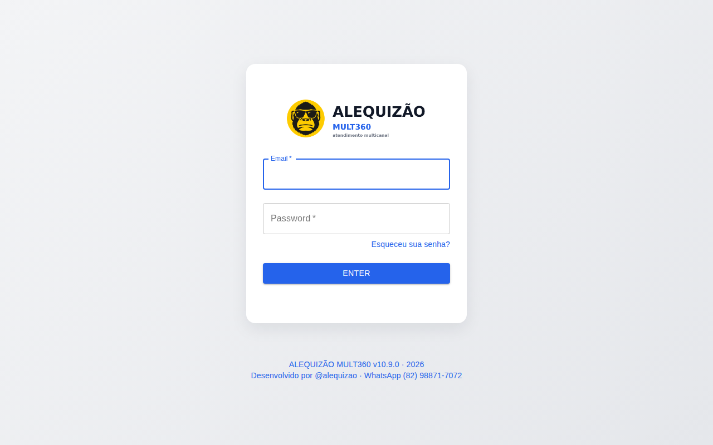
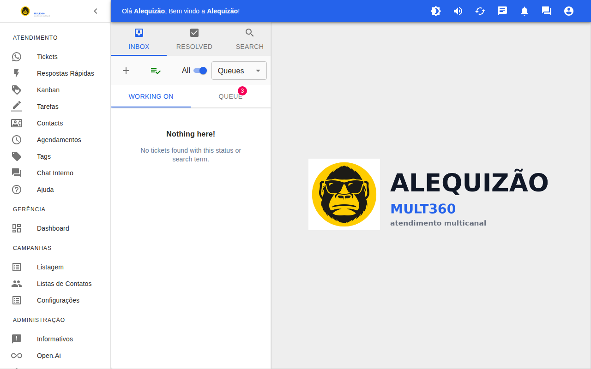
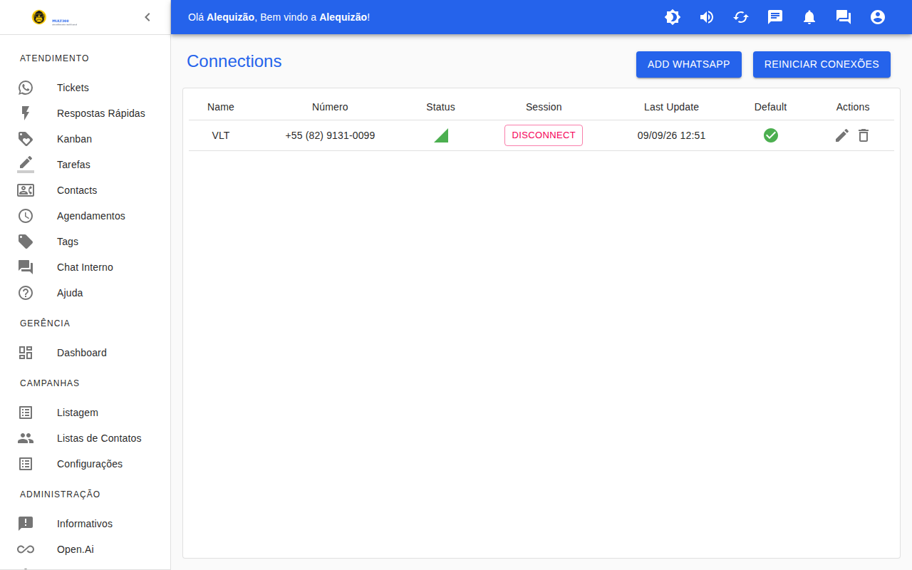
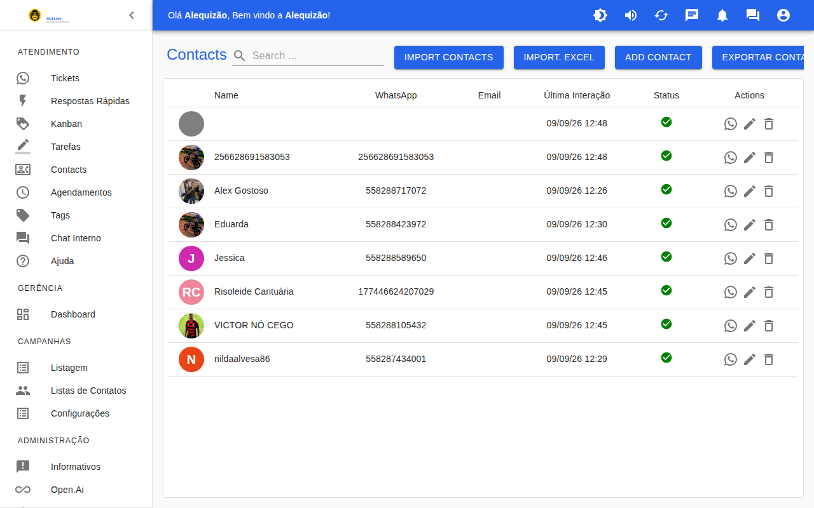
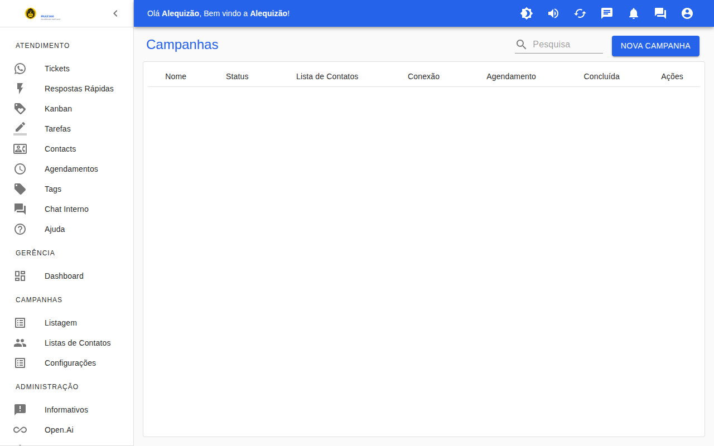
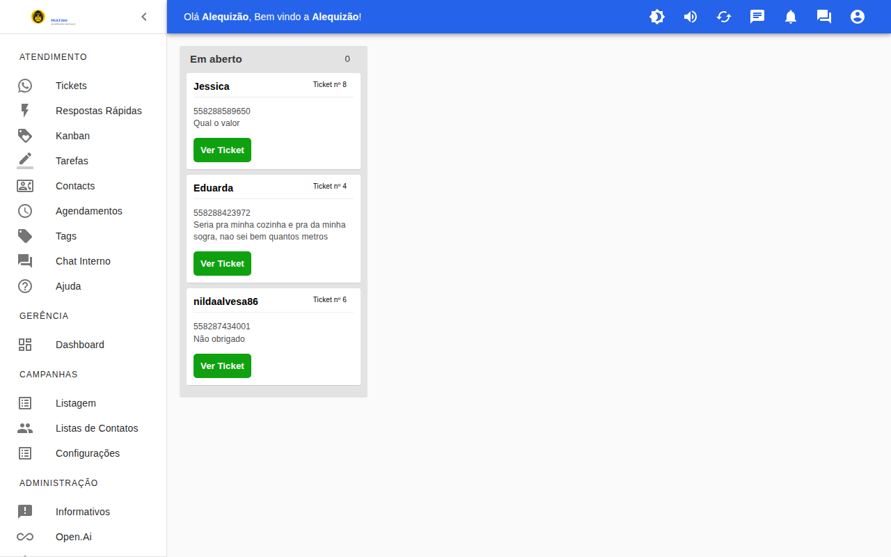

# ALEQUIZÃO MULT360

Plataforma de atendimento multicanal via WhatsApp (multiusuário, filas, chatbot, campanhas, Kanban, IA) — baseada no Whaticket SaaS, com correções e módulos próprios do **Alequizão**.

## 📸 Telas do sistema

| Login | Atendimentos |
|:---:|:---:|
|  |  |

<details>
<summary>Mais telas</summary>

| Conexões | Contatos |
|:---:|:---:|
|  |  |

| Campanhas | Kanban |
|:---:|:---:|
|  |  |

</details>

## ✨ O que foi feito em cima do Whaticket SaaS (marcado `ALEQUIZAO` no código)

- **Respostas Automáticas por palavra-chave, sem fila** (`/auto-replies`): "areia" → "Não vendemos areia", com tipos de comparação, intervalo anti-repetição, contador de disparos e testador.
- **Suporte a LID** (novo identificador do WhatsApp): envio, leitura, foto e fusão automática do contato com o telefone real.
- **Contatos salvos automaticamente com nome e foto** (agenda do celular + pushName).
- **Sessão que não cai**: interceptores no módulo `api.js`, renovação única, bloqueio de "um dispositivo por vez" removido, token de 10 anos.
- **Login por e-mail ou usuário simples**; plano ilimitado.
- **PWA** com ícones próprios, service worker com atualização imediata, tema clean azul, logos em `backend/public/logotipos/`.
- Página de status (`index.php` + coletor por cron) para acompanhar serviços, PM2, banco, conexões e erros.

## 📖 Manual

**[MANUAL.md](MANUAL.md)** — passo a passo completo de **instalação, configuração e uso** (requisitos, banco, .env, PM2, proxy com WebSocket, primeiro acesso, conexão do WhatsApp, usuários, filas, respostas automáticas, campanhas, Kanban, chat interno, API, backup e problemas comuns).

Histórico técnico da implantação na VPS e das correções: [INSTALACAO.md](INSTALACAO.md).

## 🚀 Instalação (resumo)

```bash
# backend
cd backend && cp .env.example .env && npm install --legacy-peer-deps && npm run build
npm run db:migrate && npm run db:seed && pm2 start ecosystem.config.js
# frontend
cd ../frontend && cp .env.example .env && npm install --legacy-peer-deps && npm run build
PORT=6666 pm2 start server.js --name whaticket-frontend
```

Requisitos: Node 20+, PostgreSQL 14+, Redis, PM2, proxy reverso (Apache/Nginx) com WebSocket em `/socket.io/`.

## 👨‍💻 Desenvolvedor

Sistema desenvolvido sob medida por **Alequizao**.

- **E-mail:** alequizao.dev@gmail.com
- **GitHub:** [@alequizao](https://github.com/alequizao)
- **Instagram:** [@alequizao](https://instagram.com/alequizao) · **WhatsApp:** [(82) 98871-7072](https://wa.me/5582988717072)

Quer um sistema como este para o seu negócio? Entre em contato.

---

© Alequizão · Base Whaticket SaaS (comunidade). Módulos e correções próprios: uso, cópia ou redistribuição somente com autorização.
